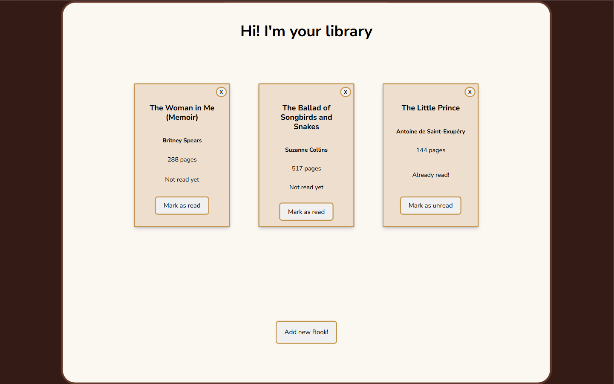
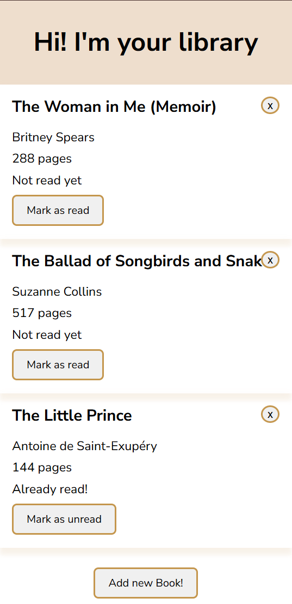

# Library App

[](https://orianaland.github.io/Library/)  
  
  


## Description

A responsive book library application built with JavaScript as part of [The Odin Project](https://www.theodinproject.com/) curriculum. This project demonstrates object-oriented programming principles, form handling, and DOM manipulation to create a fully functional book tracking system.

## Features

- **Book Management**:
  - Add new books with title, author, page count, and read status
  - Remove books from the library
  - Toggle read/unread status
- **Responsive Design**:
  - Mobile-first approach
  - Grid layout for larger screens
  - Adaptive card sizing
- **Interactive UI**:
  - Modal dialog for adding books
  - Form validation
  - Hover and focus states
  - Confirmation for deletions
- **Visual Design**:
  - Warm, book-themed color palette
  - Card-based layout
  - Smooth transitions and animations

## Technologies Used

- **HTML5**: Semantic structure and dialog element
- **CSS3**:
  - Flexbox and Grid for layout
  - Custom properties (CSS variables)
  - Media queries for responsiveness
  - Transition animations
- **JavaScript**:
  - ES6 Classes for book objects
  - Array methods for library management
  - Event delegation
  - Form validation
- **Google Fonts**: Nunito Sans for clean typography

## Live Demo

[Try the Library App](https://orianaland.github.io/Library/)

## Screenshots

### Desktop View



### Mobile View



## Installation

To run locally:

```bash
git clone https://github.com/orianaland/Library.git
cd Library
open index.html
```
